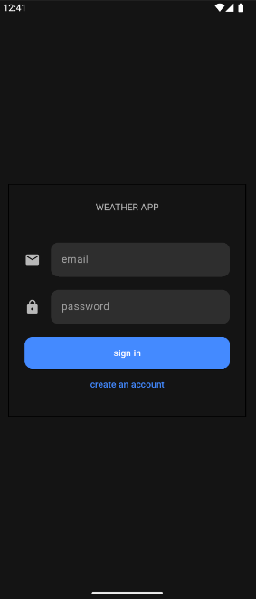
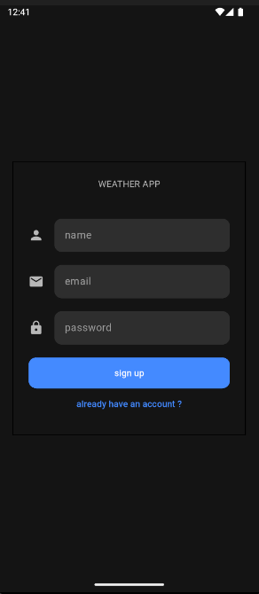
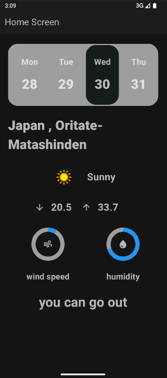

# Weather App

A clean architecture weather application with Firebase backend.

## Key Features

- **Clean Architecture**  
  - Easy maintenance  
  - Better testability  
  - Clear separation of concerns  

- **Firebase Integration**  
  - 🔐 Firebase Auth for user authentication  
  - 📁 Firestore for user data storage  

- **User Flow**  
  - Sign up/in screens  
  - Home screen with weather data  
  - Logout confirmation  

## Screenshots

<!-- Place your designs here - recommended after features section -->
<!-- Example: -->
  
*Login screen design*

  
*Login screen design*

  
*Home screen with weather data and logout button*

## Technical Details

- **Backend**: Firebase (Auth + Firestore)  
- **Architecture**: Clean Architecture pattern  
- **State Management**: Bloc 

## Setup

1. Clone the repository
2. Add your Firebase config files
3. Run `flutter pub get`
4. Launch with `flutter run`

## Future Improvements

- Add more weather details  
- Implement user preferences  
